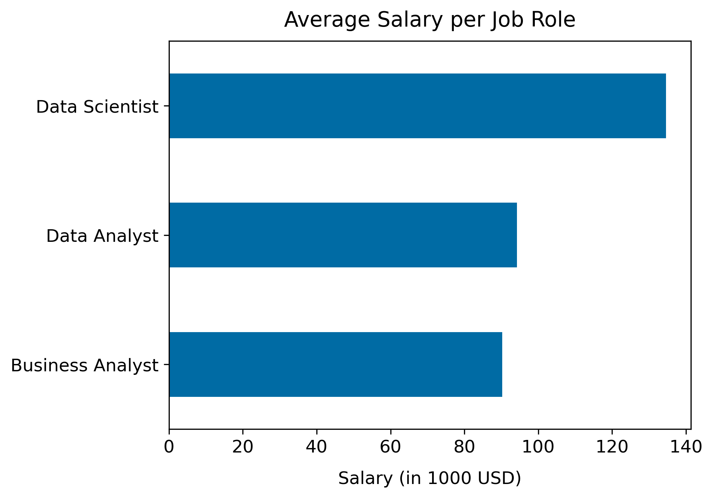

# Introduction
Dive into the data job market 💼 📊! Explore the top skills and salaries of 👨‍💼 Business Analysts, 🧑‍💻 Data Analysts, and 🧑‍🔬 Data Scientists.

Check out the SQL queries here: [SQL queries](/queries/)
Looking for the Python Code? Check out the Jupyter Notebook here: [Jupyter Notebook](/results.ipynb/)

# Background
There are plenty of different roles in today's data job market. However, it is not entirely clear how the roles of 👨‍💼 Business Analysts, 🧑‍💻 Data Analysts, and 🧑‍🔬 Data Scientists differ.

### This project aims to answer the following questions:

1. How does the average salary compare between Business Analysts, Data Analysts, and Data Scientists?
2. How do the required skills differ between Business Analysts, Data Analysts, and Data Scientists?
3. Which are the top-paying skills for Business Analysts, Data Analysts, and Data Scientists?
4. Which are the optimal skills to learn for Business Analysts, Data Analysts, and Data Scientists?

# Tools I Used
To dive into the data and derive insights, I harnessed the power of several key tools.

- **SQL**: The basis for my analysis. It allowed me to access and query the data set on data job postings provided by the Youtuber and Data Analyst [Luke Barousse](https://www.lukebarousse.com/).
- **Python**: Used to futher clean and visualize the data set to obtain answers for the questions posed.
- **PostgreSQL**: The data base management system chosen for this project.
- **Visual Studio Code**: My favorite code editor for data analysis.
- **Git & GitHub**: Crucial for version control and sharing scripts and analyses, ensuring collaboration and project tackling.

# Analysis
Each SQL-query for this project tackled one of the questions I had about the data job market.
Here's how I approached each question:

### 1. Average Salary
To obtain the average salary for Business Analysts, Data Analysts, and Data Scientists, I filtered the data to only include Business Analysts, Data Analysts, and Data Scientists. Moreover, I excluded remote jobs and focused on full-time jobs.

```sql
-- Let's have a look at the different job titles in the data set.
SELECT
    DISTINCT(job_title_short)
FROM
    job_postings_fact

-- Compute average salary grouped by job title.
SELECT
    job_title_short AS role,
    ROUND(AVG(salary_year_avg), 0) AS avg_yearly_salary
FROM
    job_postings_fact
WHERE
    job_title_short IN ('Business Analyst', 'Data Analyst', 'Data Scientist') AND
    NOT job_location = 'Anywhere' AND
    job_schedule_type = 'Full-time' AND
    salary_year_avg IS NOT NULL
GROUP BY
    role
```

Based on this query, I then visualized the average salaries in a bar chart.

```py
# Import packages
import numpy as np, pandas as pd
import matplotlib.pyplot as plt

# Adjust default matplotlib settings
plt.style.use('tableau-colorblind10')
plt.rcParams['font.size'] = 12
plt.rcParams['lines.linewidth'] = 2
plt.rcParams['axes.titlepad'] = 10
plt.rcParams['axes.labelpad'] = 10
plt.rcParams['font.family'] = 'sans-serif'

# Read csv
df_avg_salaries = pd.read_csv('./data/1_avg_salary.csv')

# Create new column to display salary in 1000s
df_avg_salaries['avg_yearly_salary_1000'] = df_avg_salaries['avg_yearly_salary'] / 1000

# Plot
df_avg_salaries.plot(x='role', y='avg_yearly_salary_1000', kind='barh',
                     xlabel='Salary (in 1000 USD)', ylabel='', legend='',
                     title='Average Salary per Job Role');
```



**Insights**: 
- The average salary is highest for Data Scientists and lowest for Business Analysts.
- The difference in average salary between Data Scientists and Business Analysts (or Data Analysts) is much larger than the difference in average salary between Business Analysts and Data Analysts.


# What I learned
# Conclusions
