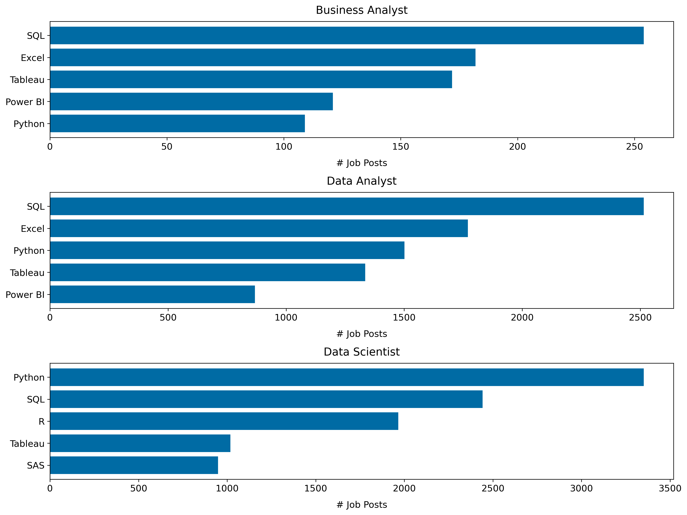
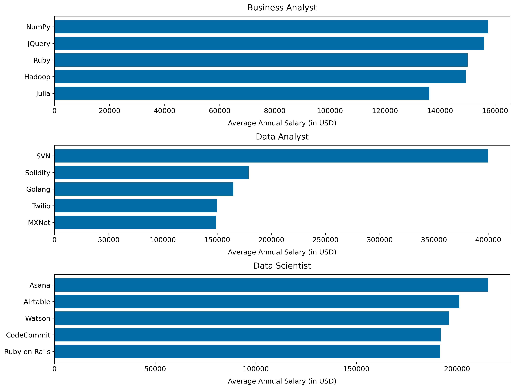

# Introduction
Dive into the data job market 💼 📊! Explore the top skills and salaries of 👨‍💼 Business Analysts, 🧑‍💻 Data Analysts, and 🧑‍🔬 Data Scientists.

Check out the SQL queries here: [SQL queries](/queries/) \
Looking for the Python Code? Check out the Jupyter Notebook here: [Jupyter Notebook](/results.ipynb/)

# Background
There are plenty of different roles in today's data job market. However, it is not entirely clear how the roles of 👨‍💼 Business Analysts, 🧑‍💻 Data Analysts, and 🧑‍🔬 Data Scientists differ.

### This project aims to answer the following questions:
1. How does the average salary compare between Business Analysts, Data Analysts, and Data Scientists?
2. How do the desired skills differ between Business Analysts, Data Analysts, and Data Scientists?
3. Which are the top-paying skills for Business Analysts, Data Analysts, and Data Scientists?
4. Which are the optimal skills to learn for Business Analysts, Data Analysts, and Data Scientists?

### Data Source
The data set contains a multitude of job postings in the area of data from all around the world. It was collected by the YouTuber and Data Analyst [Luke Barousse](https://www.lukebarousse.com/) to gain insights about the desired skills and salaries in the data job market. The full data set can be accessed here: <https://datanerd.tech/>.

# Tools I Use
To dive into the data and derive insights, I harness the power of several key 🛠️ tools.

- **SQL**: The basis for my analysis. It allows me to access and query the data set on data job postings.
- **Python**: Used to futher clean and present the insights to obtain answers for the questions posed.
- **PostgreSQL**: The data base management system chosen for this project.
- **Visual Studio Code**: My favorite code editor for analyzing data.
- **Git & GitHub**: Crucial for version control and sharing scripts and analyses, ensuring collaboration and project tackling.

# Analysis
Each SQL-query for this project tackles one of the questions I have about the data job market.
Here's how I approach each question:

### 1. Average Salary
To obtain the average salaries for Business Analysts, Data Analysts, and Data Scientists, I filter the data to only include Business Analysts, Data Analysts, and Data Scientists. Moreover, I exclude remote jobs and focus on full-time jobs.

```sql
-- Let's have a look at the different job titles in the data set.
SELECT
    DISTINCT(job_title_short)
FROM
    job_postings_fact

-- Compute average salary grouped by job title.
SELECT
    job_title_short AS role,
    ROUND(AVG(salary_year_avg), 0) AS avg_yearly_salary
FROM
    job_postings_fact
WHERE
    job_title_short IN ('Business Analyst', 'Data Analyst', 'Data Scientist') AND
    NOT job_location = 'Anywhere' AND
    job_schedule_type = 'Full-time' AND
    salary_year_avg IS NOT NULL
GROUP BY
    role
```

Based on this query, I visualize the average salaries in a bar chart using Python.

```py
# Import packages
import numpy as np, pandas as pd
import matplotlib.pyplot as plt

# Adjust default matplotlib settings
plt.style.use('tableau-colorblind10')
plt.rcParams['font.size'] = 12
plt.rcParams['lines.linewidth'] = 2
plt.rcParams['axes.titlepad'] = 10
plt.rcParams['axes.labelpad'] = 10
plt.rcParams['font.family'] = 'sans-serif'

# Read csv
df_avg_salaries = pd.read_csv('./data/1_avg_salary.csv')

# Create new column to display salary in 1000s
df_avg_salaries['avg_yearly_salary_1000'] = df_avg_salaries['avg_yearly_salary'] / 1000

# Plot
df_avg_salaries.plot(x='role', y='avg_yearly_salary_1000', kind='barh',
                     xlabel='Salary (in 1000 USD)', ylabel='', legend='',
                     title='Average Salary per Job Role');
```

<p align='center'>
    
</p>

**Insights**: 
- The average salary is highest for Data Scientists and lowest for Business Analysts.
- The difference in average salary between Data Scientists and Business Analysts (or Data Analysts) is much larger than the difference in average salary between Business Analysts and Data Analysts.
- All roles are well paid with an average salary of over 80'000 USD per year.

### 2. Top Skills per Role
To reveal the top desired skills for Business Analysts, Data Analysts, and Data Scientists, I again filter for these roles and focus on onsite, full-time jobs using a CTE. As the skills required for a specific job are contained in two other tables, I join them with the CTE.

```sql
-- CTE to filter the jobs, i.e., only looking at onsite and full-time jobs for BA, DA and DSc
WITH filtered_jobs AS (
    SELECT *
    FROM 
        job_postings_fact
    WHERE
        job_title_short IN ('Business Analyst', 'Data Analyst', 'Data Scientist') AND
        NOT job_location = 'Anywhere' AND
        job_schedule_type = 'Full-time' AND
        salary_year_avg IS NOT NULL
)

-- Join with skills tables and count number of job posts for a specific skill
SELECT
    job_title_short AS role,
    skills,
    COUNT(skills_job_dim.job_id) AS demand_count
FROM
    filtered_jobs
INNER JOIN skills_job_dim ON filtered_jobs.job_id = skills_job_dim.job_id
INNER JOIN skills_dim ON skills_job_dim.skill_id = skills_dim.skill_id
GROUP BY
    role, skills
```

Based on this query, I use Python to extract and visualize the top 5 desired skills by role.

```py
# Read data
df_skills = pd.read_csv('./data/2_skills.csv')

# Group df by role and find 5 most common skills
df_skills_grouped = df_skills.groupby('role') \
    .apply(lambda x: x.nlargest(5, 'demand_count'), include_groups=False) \
    .reset_index(drop=False) \
    .drop('level_1', axis=1)

# Adjust skill names
df_skills_grouped['skills'] = df_skills_grouped['skills'].str.capitalize()
df_skills_grouped['skills'] = df_skills_grouped['skills'].replace(
    {'Power bi': 'Power BI', 'Sql': 'SQL','Sas': 'SAS'}
)

# Write helper function for plot
def plot_by_role(df_skills_grouped, role, ax, x_axis, x_label):
    temp = df_skills_grouped[df_skills_grouped['role'] == role].sort_values(by=x_axis, ascending=True)
    ax.barh(temp['skills'], temp[x_axis])
    ax.set_title(role)
    ax.set_xlabel(x_label)

# Plot
_, axes = plt.subplots(3, 1)

for i, role in enumerate(df_skills_grouped['role'].unique()):
    plot_by_role(df_skills_grouped, role, axes[i], 'demand_count', '# Job Posts')

plt.tight_layout(rect=[-1, -1, 1, 1])
plt.savefig('plots/skills.png', dpi=300, bbox_inches='tight')
```



**Insights**: 
- The top five skills for Business Analysts and Data Analysts are very similar. For both roles, SQL and Excel lead the list and also include Tableau, Power BI and Python.
- In contrast, the top five skills for Data Scientists are slightly different. The list additionally includes R and SAS but does not include Excel.

### 3. Top-paying Skills per Role
Filtering the job posts as previously, I compute the average salary per skill and role.

```sql
-- CTE to filter jobs
WITH filtered_jobs AS (
    SELECT *
    FROM 
        job_postings_fact
    WHERE
        job_title_short IN ('Business Analyst', 'Data Analyst', 'Data Scientist') AND
        NOT job_location = 'Anywhere' AND
        job_schedule_type = 'Full-time' AND
        salary_year_avg IS NOT NULL
)

-- Compute average salary per skill and role
SELECT
    job_title_short AS role,
    skills,
    ROUND(AVG(salary_year_avg), 0) AS avg_yearly_salary
FROM
    filtered_jobs
INNER JOIN skills_job_dim ON filtered_jobs.job_id = skills_job_dim.job_id
INNER JOIN skills_dim ON skills_job_dim.skill_id = skills_dim.skill_id
GROUP BY
    skills, role
```

Similarly to question 2, I display the top-paying skills per role in bar chart created with Python.

```py
# Read data
df_pay_skills = pd.read_csv('./data/3_top_paid_skills.csv')

# Group df by role and find 5 highest-paying skills
df_pay_skills_grouped = df_pay_skills.groupby('role') \
    .apply(lambda x: x.nlargest(5, 'avg_yearly_salary'), include_groups=False) \
    .reset_index(drop=False) \
    .drop('level_1', axis=1)

# Adjust skill names
df_pay_skills_grouped['skills'] = df_pay_skills_grouped['skills'].str.capitalize()
df_pay_skills_grouped['skills'] = df_pay_skills_grouped['skills'].replace(
    {'Numpy': 'NumPy', 'Jquery': 'jQuery', 'Svn': 'SVN', 'Mxnet': 'MXNet',
     'Codecommit': 'CodeCommit', 'Ruby on rails': 'Ruby on Rails'}
)

# Plot
_, axes = plt.subplots(3, 1)

for i, role in enumerate(df_pay_skills_grouped['role'].unique()):
    plot_by_role(df_pay_skills_grouped, role, axes[i], 'avg_yearly_salary', 'Average Annual Salary (in USD)')

plt.tight_layout(rect=[-1, -1, 1, 1])
plt.savefig('plots/top_paid_skills.png', dpi=300, bbox_inches='tight')
```



**Insights**:
- For all job roles, the top-paying skills are relatively niche.
- The top-paying skills greatly differ depending on the job role.
- It seems likely that the demand for most of these top-paying skills is rather small.

### 4. Optimal Skills to Learn
Ultimately, the optimal skills to learn should not only pay well but also be in high demand. Therefore, I include both information about the skill demand and the average annual salary associated with a specific skill.

```sql
-- CTE to filter jobs
WITH filtered_jobs AS (
    SELECT *
    FROM 
        job_postings_fact
    WHERE
        job_title_short IN ('Business Analyst', 'Data Analyst', 'Data Scientist') AND
        NOT job_location = 'Anywhere' AND
        job_schedule_type = 'Full-time' AND
        salary_year_avg IS NOT NULL
)

SELECT
    job_title_short AS role,
    skills AS skill,
    COUNT(skills_job_dim.job_id) AS demand_count,
    ROUND(AVG(salary_year_avg), 0) AS avg_yearly_salary
FROM
    filtered_jobs
INNER JOIN skills_job_dim ON filtered_jobs.job_id = skills_job_dim.job_id
INNER JOIN skills_dim ON skills_job_dim.skill_id = skills_dim.skill_id
GROUP BY
    role, skills_dim.skill_id
```

I use Python to select only those skills that exceed the 90th percentile per job role and order them by their associated average yearly salary. This gives us the skills which are not only high in demand but also well-paid.

```py
# Read data
df_optimal_skills = pd.read_csv('./data/4_optimal_skills.csv')

# Compute 90th percentile of demand_count per role and add it to df
df_percentiles = df_optimal_skills \
    .groupby('role')['demand_count'] \
    .apply(lambda x: np.percentile(x, 90))

df_optimal_skills = df_optimal_skills.join(df_percentiles, on='role', rsuffix='_90th')

# Filter only rows exceeding the 90th percentile
df_optimal_skills = df_optimal_skills[df_optimal_skills['demand_count'] > df_optimal_skills['demand_count_90th']] \
                        .drop('demand_count_90th', axis=1)

# Write function to display the optimal skills
def display_optimal_skills(role, df=df_optimal_skills):
    df = df[df['role'] == role] \
    .sort_values(by='avg_yearly_salary', ascending=False) \
    .drop('skill_id', axis=1) \
    .reset_index(drop=True)
    return df

# Optimal skills for Business Analysts
display_optimal_skills('Business Analyst').head()
```

| Role             | Skill     | Demand Count | Average Annual Salary |
|------------------|-----------|--------------|-----------------------|
| Business Analyst | Snowflake | 31           | 113611                |
| Business Analyst | R         | 57           | 107081                |
| Business Analyst | Python    | 109          | 103194                |
| Business Analyst | Tableau   | 172          | 98297                 |
| Business Analyst | Flow      | 43           | 95082                 |

```py
# Optimal Skills for Data Analysts
display_optimal_skills('Data Analyst').head()
```

| Role         | Skill     | Demand Count | Average Annual Salary |
|--------------|-----------|--------------|-----------------------|
| Data Analyst | Snowflake | 189          | 112746                |
| Data Analyst | AWS       | 242          | 106936                |
| Data Analyst | Looker    | 201          | 105154                |
| Data Analyst | Azure     | 269          | 104879                |
| Data Analyst | Python    | 1501         | 102023                |

```py
# Optimal Skills for Data Scientists
display_optimal_skills('Data Scientist').head()
```

| Role           | Skill         | Demand Count | Average Annual Salary |
|----------------|---------------|--------------|-----------------------|
| Data Scientist | PyTorch       | 419          | 143839                |
| Data Scientist | Spark         | 746          | 143445                |
| Data Scientist | Scala         | 295          | 142176                |
| Data Scientist | TensorFlow    | 483          | 141164                |
| Data Scientist | Scikit-learn  | 302          | 140625                |

**Insights**:
- In addition to Python, cloud computing skills such as Snowflake, AWS, and Azure are important skills to learn as Business Analysts and Data Analysts.
- For Data Scientists, Python libraries for Machine Learning such as PyTorch, TensorFlow, and Scikit-learn are significant skills to learn.

# What I learned
# Conclusions
